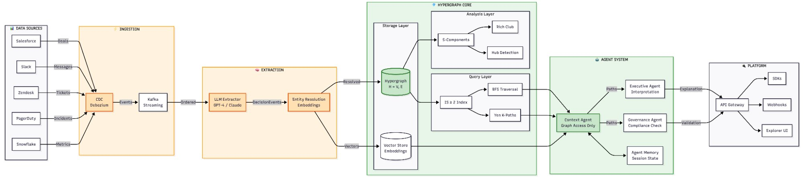

# System Architecture

## Overview

The Hypergraph Context Graph is an infrastructure layer for institutional memory in enterprise AI systems. It captures decision context using hypergraph-native storage and provides reasoning constraints for agentic AI platforms.



---

## Architecture Layers

### 1. Data Sources

Enterprise systems that generate decision-relevant data:

| Source | Data Type | Examples |
|--------|-----------|----------|
| **Salesforce** | Deals, Accounts | Opportunity records, account health scores |
| **Slack** | Messages | Approval threads, escalation discussions |
| **Zendesk** | Tickets | Support cases, SLA breaches |
| **PagerDuty** | Incidents | Outages, severity levels, resolution times |
| **Snowflake** | Metrics | Usage data, aggregated KPIs |

---

### 2. Ingestion Layer

Real-time capture of changes across enterprise systems.

#### CDC Connectors (Debezium)
- Captures row-level changes from source databases
- Maintains ordering and exactly-once semantics
- Supports PostgreSQL, MySQL, MongoDB, and more

#### Stream Processing (Kafka)
- Event ordering and deduplication
- Backpressure handling
- Replay capability for reprocessing

**Data Flow:**
```
Source DB → CDC Connector → Kafka Topic → Consumer
```

---

### 3. Extraction Layer

Transforms raw events into structured decision events.

#### LLM Extractor (GPT-4 / Claude)
- **Dual-pass extraction**: Coarse pass identifies decision candidates, fine pass extracts structured data
- **Schema enforcement**: JSON mode ensures consistent output
- **Confidence scoring**: Each extraction includes certainty level

**Decision Event Schema:**
```python
class DecisionEvent:
    participants: List[str]      # N-ary: all entities involved
    decision_type: str           # approval, escalation, renewal
    relation: str                # The action taken
    operational_context: List[str]  # SOPs, policies referenced
    analytical_context: List[str]   # Metrics, calculations used
    rationale: Optional[str]     # The "why" behind the decision
```

#### Entity Resolution
- **Vector embeddings** for semantic matching
- **Cosine similarity ≥ 0.95** threshold for entity merging
- Handles: "Acme Corp" = "Acme Corporation" = "ACME" = `cust_acme`
- **Incremental matching**: New entities matched against existing graph

---

### 4. Hypergraph Core

The central storage and query engine for n-ary relationships.

#### Storage Layer

**Hypergraph Store (H = V, E)**
- **Nodes (V)**: Entities (customers, deals, people, policies, incidents)
- **Hyperedges (E)**: Decision events connecting 3+ nodes simultaneously
- Unlike pairwise graphs, a single hyperedge captures the full context

**Vector Store**
- Entity embeddings for semantic search
- Decision event embeddings for similarity queries
- Enables "find similar decisions" functionality

#### Query Layer

**IS ≥ 2 Index**
- Intersection Size constraint: Adjacent hyperedges must share ≥2 nodes
- Eliminates spurious paths through unrelated decisions
- From Stewart & Buehler (MIT, 2026): "Paths are recovered under a node intersection constraint"

**BFS Traversal**
- Breadth-first search for shortest paths
- Respects intersection constraints
- Returns provenance chain for any decision

**Yen K-Paths**
- Finds K shortest paths between entities
- Useful for "show me all ways these entities are connected"
- Supports path diversity requirements

#### Analysis Layer

**S-Connected Components**
- Groups of hyperedges connected at intersection size S
- Higher S = more stable, established patterns
- Lower S = emerging, less established patterns

**Rich Club Analysis**
- Measures whether high-degree nodes preferentially connect
- Identifies decision-making concentration
- From paper: "Hub integration scores measure how frequently each high-degree concept co-occurs with other hubs"

**Hub Detection**
- Identifies central entities in decision-making
- Power law degree distribution (exponent ~1.23)
- Key customers, policies, and people emerge as hubs

---

### 5. Agent System

Multi-agent architecture for decision reasoning.

#### Context Agent (Graph Access Only)
- **Only agent with hypergraph access** — security boundary
- Finds relevant paths given a query
- Returns structured path data to other agents
- Does NOT interpret — just retrieves

#### Executive Agent
- Receives paths from Context Agent
- Provides **mechanistic interpretation**
- Explains the "why" behind decision chains
- Generates human-readable explanations

#### Governance Agent
- Validates decisions against policies
- Checks compliance requirements
- Identifies precedent and exceptions
- Recommends follow-up actions

#### Agent Memory
- Session state across interactions
- Caches recent queries
- Maintains conversation context

**Agent Flow:**
```
User Query
    │
    ▼
Context Agent ──► Finds hypergraph paths
    │
    ├──► Executive Agent ──► Interprets mechanistically
    │
    └──► Governance Agent ──► Validates compliance
    │
    ▼
Combined Response
```

---

### 6. Platform Layer

External interfaces for consuming the hypergraph.

| Interface | Purpose |
|-----------|---------|
| **API Gateway** | REST/GraphQL endpoints for queries |
| **SDKs** | Python, JavaScript, Go client libraries |
| **Webhooks** | Push notifications for decision events |
| **Explorer UI** | Visual path exploration and debugging |

---

## Data Flow Summary

```
1. Salesforce deal updated
      ↓
2. CDC captures change → Kafka
      ↓
3. LLM extracts: "Deal X approved by VP Y for Customer Z with 20% discount"
      ↓
4. Entity resolution: Maps to existing nodes or creates new
      ↓
5. Hyperedge created: {deal_x, vp_y, customer_z, discount_policy}
      ↓
6. Indexes updated: IS constraints, S-components recalculated
      ↓
7. Query: "Why did Customer Z get 20% discount?"
      ↓
8. Context Agent: Finds path through incident history + VP approval
      ↓
9. Executive Agent: "Customer Z had SLA breach, VP approved retention discount"
      ↓
10. Governance Agent: "Compliant with discount policy, precedent exists"
```

---

## Key Differentiators

| Traditional Graph | Hypergraph Context Graph |
|-------------------|--------------------------|
| Pairwise edges (A→B) | N-ary hyperedges ({A,B,C,D}) |
| Loses context in expansion | Preserves full decision context |
| No intersection constraints | IS ≥ 2 eliminates spurious paths |
| Post-hoc governance | In-path compliance validation |
| Single traversal algorithm | BFS + Yen + S-component analysis |

---

## References

1. Stewart, I.A. & Buehler, M.J. (2026). "Higher-Order Knowledge Representations for Agentic Scientific Reasoning." arXiv:2601.04878
2. [GitHub Repository](https://github.com/vibhavjoshi123/Hypergraph-for-Context-Graph)
